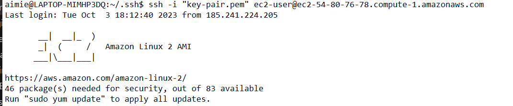
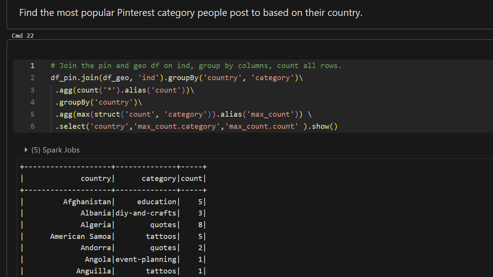
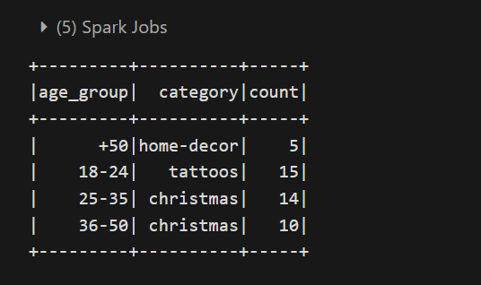
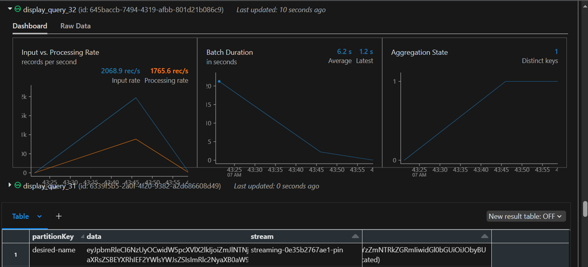

# Pinterest data pipeline

### Table of contents

- Introduction
- Project Brief
- Project Requirements
- Installation instructions
- Usage instructions
- File structure of the project 
- License information

### Introduction

This is a final project from the AIcore Data engineering programme. The project serves to equip one with essential skills in industry standard tools for building data pipelines. It fills the need to get hands on some infrastructure similar to that which a data engineer would hb find when working at Pinterest. 

### Project Brief

Pinterest uses billions of data points every day to decide how to provide more value to their users. This project is a platform for a data engineer to create a system, an emulation of Pinterest data engineering processes to facilitate a data pipeline and data processing for batch and streaming data. It uses some Apache tools and the AWS Cloud infrastructure. 

### Project Requirements

- Git hub
- Linux Kernel (or WSL for Windows users), and Git Bash for code development in the terrminal.
- Anaconda and Pip to create the required environment and install needed software dependencies.
- Amazon Web Services. AWS services, accessible from the [AWS console](https://aws.amazon.com/console/) used in the project are:
- AWS EC2 
- AWS S3
- AWS MSK
- AWS API Gateway
- AWS Managed Apache Airflow
- AWS Kinesis
- [Apache Kafka](https://kafka.apache.org/) - From the Kafka [documentation](https://kafka.apache.org/documentation/):
- For the data, we need two python files, Pinterest events emulators, one for batch processing, written to populate event data in batches from an AWS RDS server and the other for streaming data processing.
- PySpark 
   PySpark has many dependencies, not only with other Python packages, but also with other modules that are not easily installed using the convenient pip install command.To install it, follow these steps:
  - Visit PySpark download page https://spark.apache.org/downloads.html and:
  - Choose latest release
  - Download package locally
  - Create a folder (for example spark) in a directory that you know will be safe. ~/ is usually a good option.
  Extract the files from the downloaded file into the created folder. At the time of writing, the last version was Spark 3.1.2, so, in that case, your directory will look like this (in case you are using the same examples):

```
~/

│
├── spark/
│   └── spark-3.1.2-bin-hadoop3.2  <--- SPARK_HOME
│         ├── bin
│         ├── conf
│         ├── data 

 ```

It is important to set the directory as SPARK_HOME, otherwise, PySpark will not know where to find the corresponding commands. To do so, set it as an environment variable copying the following command in your ~/.bashrc file:

```
export SPARK_HOME=<path to your home directory>/spark/spark-3.1.2-bin-hadoop3.2

```
Note: The command above depends on where you extracted the files you downloaded and the version
Don't skip this step. Having an incorrectly set SPARK_HOME environment variable is the cause of many common issues with Spark.


Save your ~/.bashrc. You should be able to use PySpark now! If not, try restarting vscode, then try restarting your computer if that doesn't work. To check if the installation was successful, you can install findspark with 


`pip install findspark` and run the following:

```
import findspark

findspark.init()

```

Next,


- Install Java. Check if it is not installed first, if not use 

```sudo apt-get install openjdk-11-jdk```

to install and check for succesful installation by checking the version with `java -version`.

Then
- Get a Databricks account. 
- The project is completed in VScode, in an environment that is enabled with all dependencies to enable the above listed to function.


### Set up AWS account


Set up the required AWS account, python file, and git hub.
  - Navigate to https://aws.amazon.com/  to sign in to the AWS Console.
    Log in with your credentials like:
  - Account ID: xxxxxxxxxxxx
  - IAM user name: xxxxxxxxxxx
  - Password: xxxxxxxxxxxxx

Caution- Make sure to check you are in the correct region when using a new service while conducting the project
  
### EC2 Instances
An EC2 instance represents a virtual server in the cloud. It is a self-contained unit that includes virtual CPUs, memory, storage, and network interfaces. For this project, I used Windows Subsystem for Linux (WSL) to install a Linux distribution- Ubuntu on my terminal. This is required for the Kafka to be installed.

### Set up an EC2 client machine locally.  


To do this,


 - Create a .pem file locally. Use `touch`, `echo `or `nano` command, depending on your system.
 - Create a KeyPair. This is a key pair file which ends in the .pem extension. This file will allow a connection to the EC2 instance. 
 - Select this key pair and under the Value field select Show.This will reveal the content of your key pair. Copy its entire value (including the BEGIN and END header) and paste it in the .pem file in VSCode.
Navigate to the EC2 console and identify the instance with your unique UserId. Select this instance, and under the Details section find the Key pair name and make a note of this. Save the previously created file in the VSCode using the following format: Key pair name.pem.


###  Connect to your EC2 instance.

Follow the `Connect` instructions `(SSH client)` on the AWS EC2 console to do this.
In order to connect to the IAM authenticated cluster, you will need to install the appropriate packages on your EC2 client machine. It would look like this:




### Set up Apache Kafka on the EC2 instance

Step 1
- Connect to the EC2 client machine using the terminal. Once inside the EC2 client, install Java by running the following command:

``` 
sudo yum install java-1.8.0 

```

- Install Kafka on your client EC2 machine. Get kafka from Apache website and untar on the EC2 client machine.

``` 
 wget https://archive.apache.org/dist/kafka/2.8.1/kafka_2.12-2.8.1.tgz 
 tar xzf kafka_2.12-2.8.1.tgz 

```
Set up the security rules for the EC2 instance to allow communication with the MSK cluster.  Make sure to install the same version of Kafka as the one the cluster is running on (in this case 2.12-2.8.1), otherwise there will not be a communication with the MSK cluster. If you list your directories, you should see a Kafka directory inside your EC2 client.


Step 2:
Install the IAM MSK authentication package on your client EC2 machine. This package is necessary to connect to MSK clusters support IAM authentication. IAM access control allows MSK to enable both authentication and authorization for clusters. This means, that if a client tries to write something to the cluster, MSK uses IAM to check whether the client is an authenticated identity and also whether it is authorized to produce to the cluster.

To connect to a cluster that uses IAM authentication, follow these additional steps before a topic can be created on the client machine.

First, navigate to your Kafka installation folder and then to the libs folder. Inside here, download the IAM MSK authentication package from Github, using the following command:

`wget https://github.com/aws/aws-msk-iam-auth/releases/download/v1.1.5/aws-msk-iam-auth-1.1.5-all.jar`

To read more about this package, check out their Github repository: https://github.com/aws/aws-msk-iam-auth.

Step 3:
Before configuring the EC2 client to use AWS IAM for cluster authentication, you will need to:

- Navigate to the IAM console on your AWS account.
- Here, on the left hand side select the Roles section
- You should see a list of roles, select the one with the following format: <your_UserId>-ec2-access-role
- Copy this role ARN and make a note of it, as you will be using it later for the cluster authentication
- Go to the Trust relationships tab and select Edit trust policy
- Click on the Add a principal button and select IAM roles as the Principal type
- Replace ARN with the <your_UserId>-ec2-access-role ARN you have just copied


By following the steps above, the <your_UserId>-ec2-access-role, which contains the necessary permissions to authenticate to the MSK cluster is assumed.


Step 4:
- Configure your Kafka client to use AWS IAM authentication to the cluster. To do this, modify the client.properties file, inside the kafka_folder/bin directory accordingly. 


### Create Kafka topics


Step 1:


- To create a topic, retrieve some information about the MSK cluster, specifically: the *Bootstrap servers string* and the *Plaintext Apache Zookeeper connection string*. Make a note of these strings, as they will be needed in the next step.This can be retreived with the MSK Management Console or by using the AWS CLI.


Step 2:


The following three topics were created:


1.  0e35b2767ae1.pin for the Pinterest posts data
2.  0e35b2767ae1.geo for the post geolocation data
3.  0e35b2767ae1.user for the post user data


Before running any Kafka commands, CLASSPATH environment variable must be set properly.


In the create topic Kafka command replace the `BootstrapServerString` with the value you have obtained in the previous step.Topics muat be the exact names specified on the MSK cluster. Follow the format, otherwise you will run into permission errors.


- Building the pipeline
    - Create an Apache cluster using AWS MSK
    - Create a client machine for the cluster
    - Enable client machine to connect to the cluster
    - Install Kafka on the client machine
    - Create topics on the Kafka cluster. Three topics were created, a pin, a user data and a geo location data pin.
    - Deliver messages to the Kafka cluster using the API gateway


## Batch processing

An API is built in Amazon API Gateway that will send data to an S3 bucket. Then Amazon MSK Connect is used to connect MSK clusters to the S3 bucket so that data from the clusters is saved in the S3 bucket. To do this,

- Create a S3 bucket, an IAM role that allows you to write to the bucket or a VPC Endpoint to S3.
- Go to the S3 console and select your bucket. Make a note of the bucket name, as you will need it in the other steps.
- On your EC2 client, download the Confluent.io Amazon S3 Connector and copy it to your S3 bucket.
- Create a custom plugin in the MSK Connect console. For this project my AWS account only has permissions to create a custom plugin with the following name: 0e35b2767ae1-plugin. 
- Create a connector with MSK Connect. 


When building the connector, make sure to choose the IAM role used for authentication to the MSK cluster in the Access permissions tab. After building the plugin-connector pair, data passing through the IAM authenticated cluster, will be automatically stored in the designated S3 bucket.


### Build an API and a PROXY integration for your API.


Create an API. The API name in this project is my UserId. The next step is to build a PROXY integration for your API.
On Amazon API Gateway,
- Create a resource that allows you to build a PROXY integration for your API.
- Create a HTTP ANY method. When setting up the Endpoint URL, copy the correct PublicDNS from the EC2 machine.
- Deploy the API and make a note of the Invoke URL, you will need it in a later task.


### Set up the Kafka REST Proxy integration for your API, set up the Kafka REST Proxy on your EC2 client machine.


- First, download and install the Confluent package for the Kafka REST Proxy on your EC2 client machine.
- Allow the REST proxy to perform IAM authentication to the MSK cluster by modifying the kafka-rest.properties file.
- Start the REST proxy on the EC2 client machine.


 ### Send data to your API
 
 Sending data to the API will send the data to the MSK Cluster using the plugin-connector pair previously created.


Step 1:

Use the user_posting_emulation.py to send data to your Kafka topics using your API Invoke URL. Data will be sent from the three tables to their corresponding Kafka topics.


Step 2:

Check data is sent to the cluster by running a Kafka consumer (one per topic). If everything has been set up correctly, you should see messages being consumed.


Step 3:

Check if data is getting stored in the S3 bucket. The folder organization here will be topics/<your_UserId>.pin/partition=0/ that your connector creates in the bucket.


## Batch processing with Databricks


Databricks is an integrated analytics environment powered by Apache Spark which lets you connect and read from many data sources such as AWS S3, HDFS, MySQL, Cassandra etc. In this project, data is read from an Amazon S3 bucket.


### Create an access key and a secret access key for Databricks in AWS

  - Access the IAM console in your AWS account. 
  - In the IAM console, under Access management click on Users.  
  - Click on the Add users button.
  - Enter the desired User name and click Next.
  - On the permission page, select the Attach existing policies directly choice. In the search bar type AmazonS3FullAccess and check the box. (This will allow full access to S3, meaning Databricks will be able to connect to any existing buckets on the AWS account.)
  - Skip the next sections until you reach the Review page. Here select the Create user button.
  - In the Security Credentials tab select Create Access Key
  - On the subsequent page select Command Line Interface (CLI), navigate to the bottom of the page click I understand.
  - On the next page, give the keypair a description and select Create Access Key.
  - Click the Download.csv file button to download the credentials you have just created. 
  After creating the IAM User, assign it a programmatic access key:
  - In the Security Credentials tab select Create Access Key
  - On the subsequent page select Command Line Interface (CLI), navigate to the bottom of the page click I understand
  - On the next page, give the keypair a description and select Create Access Key
  - Click the Download.csv file button to download the credentials you have just created.

### Upload credential csv file to Databricks

In the Databricks UI, 
 - Click the Data icon and then click Create Table.
 - Click on Drop files to upload, or click to browse and select the credentials file you have just downloaded from AWS. Once the file has been successfully uploaded, you should see a green checkmark next to it.
 The credentials will be uploaded in the following location: /FileStore/tables.


##  Batch processing: Spark on Databricks


For data to be processed in batches on Databricks, one must mount the S3 bucket on to Databricks filestore. The steps are detailed in the Databricks(data_from_S3_and_query).ipynb file. 


The steps are as follows:


### Mount S3 bucket to Databricks

 - Open a notebook in the Databricks UI, 
 - Select the New icon and then select Notebook. Codes can be written here.
 - Check the contents in FileStore, the location where we uploaded the AWS credentials in the last step, by running the following command:
 

 `dbutils.fs.ls(“/FileStore/tables”)`


 The CSV file uploaded earlier should now be inside the FileStore tables folder. 
 

 - Import the pyspark functions and URL processing libraries 
 - Check tables in filestore to get name of credentials file
 - See Databricks(data_from_S3_and_query).ipynb file for details
 - List the tables to obtain AWS credentials file name
 - Read the CSV file to Spark dataframe
 - Extract the access key and secret access key from the Spark dataframe created. The secret access key will be encoded using urllib.parse.quote for security purposes. `safe=""` means that every character will be encoded.
 See the Databricks notebook.
 - Mount the S3 bucket by passing in the S3 URL and the desired mount name to `dbutils.fs.mount()`.The S3 bucket has the messages from the Kafka topics. Successful mounting of the bucket can be tested.


To check if the S3 bucket was mounted succesfully run the following command:

```
display(dbutils.fs.ls("/mnt/`bucket_name`/topics"))

```

The bucket is mounted only once. Once mounted it is accessible from Databricks at any time.


Next steps are:
- Read the JSON format dataset from S3 into Databricks by using the `spark.read.format(file_type)` command with the infer schema option, then load the location. This creates a Spark dataframe with the dataset. This is created for the three topics.
- Display the dataframes
- Unmount S3 bucket. To unmount the S3 bucket, run the following code:

```
dbutils.fs.unmount("/mnt/mount_name")

```


## Cleaning the dataframes and sorting columns


- Remove duplicates
- Create necessary functions to convert null or bad values to None
- Convert non numeric data in the follower_count column to numbers by using `regexp_replace`
- Cast all columns with numbers only to integer type
- Cast all columns with times only to timestamp type
- Convert save_location column to include only the save location path by using `regexp_replace`
- Merge necessary columns like "longitude" and "latitude" and "first_name", "last_name" with either `array` or `concat_ws`, them drop the former columns.
- Re-order the dataframe columns.


After cleaning the dataframes, insights can be polled by querying it. See the Databricks notebook for more. Examples are:

 




## Batch processing: Orchestrating workloads with AWS MWAA


MWAA was used to automate the process of running the batch processing on Databricks. The dag.py file contains Python code for a directed acyclic graph (DAG) that orchestrates the running of the batch processing notebook described above. The file was uploaded to the MWAA environment, where Airflow is used to connect to and run the Databricks notebook at scheduled intervals, in this case daily.

To automate batch processing on Databricks, AWS MWAA (managed Workflows for Apache Airflow) can be used. See the dag.py file for the program to run this. Steps to do this are:


- Create an API token in Databricks and initialize a connection between MWAA and Databricks.
- Create an Airflow DAG that will trigger a Databricks Notebook to be run on a specific schedule. Here is daily.    This DAG should be uploaded to the dags folder in the mwaa-dags-bucket.
 Make sure to give your DAG the correct name, otherwise permission errors will occur.  
- Trigger the DAG you have uploaded in the previous step and check it runs successfully.


## Stream processing: AWS Kinesis


AWS Kinesis can collect streaming data in real time or near real-time. Kinesis allows data processing and analysis as soon as it arrives, giving instant analytical insights. A Kinesis Data Stream is a set of Shards which is a uniquely identified sequence of data records in a stream. To implement it in this project;

- Create three data streams for the three tables in the Amazon Kinesis console and then create an IAM role for API access to Kinesis.
- In API Gateway console, open the previously created REST API, and create a new resource for the streams.  Configure a `GET`, `POST`, and `DELETE` method here.
- Create two child resources `'record'` and `'records'` and configure a `PUT` method for both the child resources 
- Deploy the API, get a new invoke URL. This URL is used to extract data from Amazon RDS and store it in the respective Kinesis data streams.
- Load into the Databricks as with the batch processing and create dataframes. 
As the data is appended to the dataframe, it is presented in a serialized format and can be deserialized using .`selectExpr("CAST(data as STRING)")`. 
- Process the dataframes by cleaning them.
- Extract necessary insights from the cleaned dataframes.

Example of output from streaming data is below:


